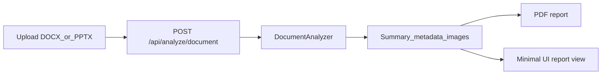

# План: Полный минималистичный редизайн + только DOCX/PPTX

## Цель

Сделать сервис узкоспециализированным для проверки офисных файлов (`.docx`, `.pptx`) и обновить интерфейс целиком в простой, нейтральный и аккуратный стиль для преподавательского сценария проверки.

## Что меняем в архитектуре

## 1) Полностью убрать image/video из backend

- Обновить [C:/Users/crump/Desktop/deepfake/deepfake/backend/app/api/routes.py](C:/Users/crump/Desktop/deepfake/deepfake/backend/app/api/routes.py):
  - удалить/отключить `POST /api/analyze/image` и `POST /api/analyze/video`;
  - оставить только `POST /api/analyze/document` (DOCX/PPTX);
  - обновить `GET /api/routes` до офисного набора эндпоинтов.
- Обновить [C:/Users/crump/Desktop/deepfake/deepfake/backend/app/main.py](C:/Users/crump/Desktop/deepfake/deepfake/backend/app/main.py):
  - описание API и список root-routes под новый scope (только офисные файлы).
- Удалить неиспользуемые импорты/ветки в backend после выпила image/video маршрутов.

## 2) Привести backend-модели и генерацию отчёта к office-only

- Проверить и при необходимости уточнить схему в [C:/Users/crump/Desktop/deepfake/deepfake/backend/app/models/schemas.py](C:/Users/crump/Desktop/deepfake/deepfake/backend/app/models/schemas.py), чтобы `AnalysisResponse` и `summary.source` соответствовали только офисному сценарию.
- Упростить ветвления в [C:/Users/crump/Desktop/deepfake/deepfake/backend/app/services/report_generator.py](C:/Users/crump/Desktop/deepfake/deepfake/backend/app/services/report_generator.py):
  - убрать условные ветки для image/video в основном потоке отчёта;
  - оставить и донастроить блоки для документа/презентации (метаданные файла + список изображений + краткие AI-флаги).
- Сохранить текущую офисную аналитику в [C:/Users/crump/Desktop/deepfake/deepfake/backend/app/services/document_analyzer.py](C:/Users/crump/Desktop/deepfake/deepfake/backend/app/services/document_analyzer.py), но почистить всё, что могло остаться от мультиформатной логики.

## 3) Полностью перевести frontend на office-only UX

- Обновить API-клиент в [C:/Users/crump/Desktop/deepfake/deepfake/frontend/src/services/api.js](C:/Users/crump/Desktop/deepfake/deepfake/frontend/src/services/api.js):
  - убрать `analyzeImage`/`analyzeVideo`;
  - оставить единую функцию загрузки офисного файла.
- Переписать загрузчик в [C:/Users/crump/Desktop/deepfake/deepfake/frontend/src/components/FileUpload.vue](C:/Users/crump/Desktop/deepfake/deepfake/frontend/src/components/FileUpload.vue):
  - accept только DOCX/PPTX;
  - валидация и тексты только под офисные форматы;
  - понятные ошибки для преподавательского сценария.
- Упростить итоговый экран в [C:/Users/crump/Desktop/deepfake/deepfake/frontend/src/components/ReportView.vue](C:/Users/crump/Desktop/deepfake/deepfake/frontend/src/components/ReportView.vue):
  - убрать терминологию и блоки, завязанные на image/video;
  - усилить блоки «сведения о документе» и «результаты проверки».
- Сохранить и доработать drilldown в [C:/Users/crump/Desktop/deepfake/deepfake/frontend/src/components/MetadataTable.vue](C:/Users/crump/Desktop/deepfake/deepfake/frontend/src/components/MetadataTable.vue):
  - документные свойства сверху;
  - список изображений с раскрытием деталей каждого.
- Подчистить [C:/Users/crump/Desktop/deepfake/deepfake/frontend/src/App.vue](C:/Users/crump/Desktop/deepfake/deepfake/frontend/src/App.vue) под новый узкий сценарий (тексты, статусы, пустые состояния).

## 4) Полный минималистичный редизайн frontend

- Полностью обновить [C:/Users/crump/Desktop/deepfake/deepfake/frontend/src/style.css](C:/Users/crump/Desktop/deepfake/deepfake/frontend/src/style.css):
  - нейтральная палитра, умеренные контрасты, меньше декоративных эффектов;
  - простые кнопки/карточки/типографика, единая вертикальная ритмика;
  - убрать визуальные паттерны, создающие «ИИшный» вид (агрессивные градиенты, кричащие акценты, слишком футуристичные блоки).
- Привести все компоненты к единому визуальному языку (заголовки, отступы, состояния, таблицы метаданных).
- Сохранить читаемость длинных полей метаданных без визуальной перегрузки.

## 5) Очистка проекта и документации

- Обновить README в [C:/Users/crump/Desktop/deepfake/deepfake/README.md](C:/Users/crump/Desktop/deepfake/deepfake/README.md):
  - убрать упоминания image/video;
  - описать только DOCX/PPTX поток.
- Проверить, остались ли «мертвые» файлы/импорты (`video_analyzer.py`, image-only ветки) и удалить/изолировать их по итогам фактического использования.

## 6) Проверка и критерии приёмки

- Backend:
  - `POST /api/analyze/document` принимает только DOCX/PPTX;
  - image/video маршруты недоступны;
  - отчёт PDF формируется для офисных файлов.
- Frontend:
  - пользователь может загрузить только DOCX/PPTX;
  - результат показывает метаданные документа + список встроенных изображений;
  - у каждого изображения работает раскрытие подробностей.
- UX/дизайн:
  - интерфейс заметно проще и минималистичнее;
  - нет визуально перегруженных «AI-style» элементов;
  - читаемость и аккуратность на десктопе и адаптиве сохранены.

## Основные риски

- После полного выпила image/video может остаться косвенная зависимость в отчётности/текстах; нужна финальная проверка imports и runtime.
- Полный редизайн всех экранов может затронуть UX-состояния ошибок/загрузки; нужно проверить каждое состояние вручную.
- Встроенные изображения в Office часто без EXIF — в UI обязательно оставить понятные fallback-сообщения.

